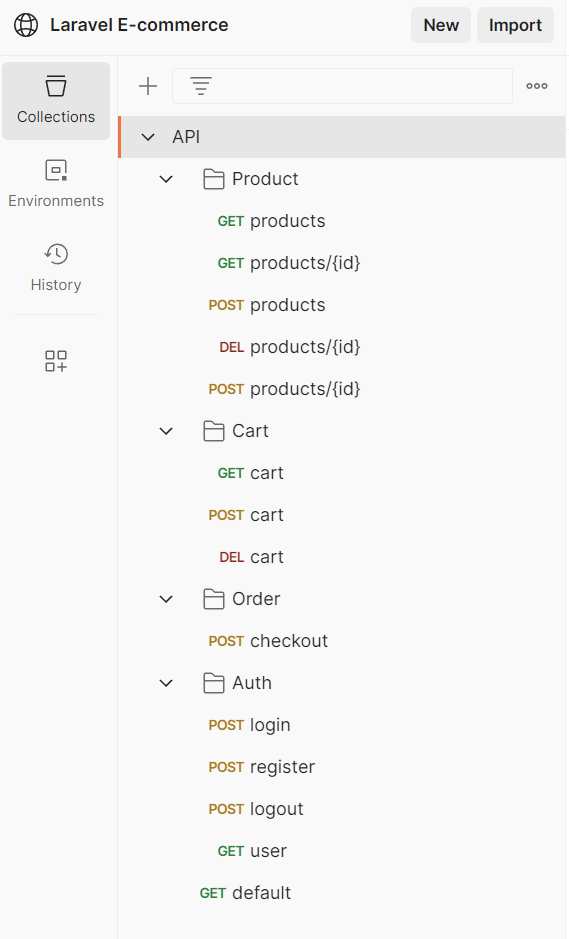

## Laravel E-Commerce

Example of a simple 'marketplace' style E-commerce platform, where users can create their own products to sell, or purchase products created by other users.
## Getting Started
Please follow the instructions below to be able to interact with this Laravel E-commerce project:  
1. Clone the repo
```sh
git clone https://github.com/GeorgeBetts/laravel-e-commerce
```
2. Copy the ENV file and generate a key 
```sh
cp .env.example .env
php artisan key:generate
```
3. Install Composer packages & dependencies
```sh
composer install
```
4. Run database migrations
```sh
php artisan migrate
```

5. Serve the application on the PHP development server
```sh
php artisan serve
```
The application / API will now be available from `http://localhost:8000`

## Using the API
To interact with the API I recommend using Postman. I have created a public workspace in Postman which contains ready to use requests for all available endpoints of the application.

[Click here to use my Postman workspace](https://www.postman.com/gbetts24/workspace/laravel-e-commerce/collection/14432749-428e82ad-ec40-407a-90c9-8f81b6da87c3?action=share&creator=14432749)



## Authentication
For authentication I am using [Laravel Sanctum SPA web authentication](https://laravel.com/docs/9.x/sanctum#how-it-works-spa-authentication) which is a stateful authentication using Laravels built-in cookie based session authentication.

Using Sanctum this way is a simple way to have an API backend for an SPA which I would also control. This provides the benefit of having CSRF protection while still allowing the same API to be used with stateless token based authentication.

As this is a simple example token based authentication has not been created for this project, but this would allow for authentication via a mobile app for example. Laravel Passport could also be used for more advanced OAuth authentication.

Certain endpoints require a user to be authorised to provide a response.

### Middleware
The middleware used by the application is defined in `app/Http/Kernel.php` and for this project it is mainly used for Auth. Middleware in use includes Sanctum Auth, default Larave CSRF protection, and other useful Laravel defaults.

Two middleware groups have been created `web` group is used for the Auth requests, such as login and register, and `api` group is used for the API endpoints.

## Users & Registration
The POST endpoint `/register` can be used to create a new user, which will also authorise the new user. The register request in the Postman collection can be used to register an example user, form data in the collectin has already been filled out.

To test if a user is authorised the GET endpoint `/user` can be used. If authorised this will return information about the logged in user.

## Products
Products can be viewed using the GET `/api/products` endpoint. A user does not need to be authenticated to browse products.

The products endpoint has a very simple example of sorting and searching. To sort a product use the query parameters `sort_column` and `sort_direction`.

To search a product by name use the `search` parameter.

| Parameter | Type | Description
| --- | --- | --- |
| search | String | Search string to filter by product name |
| sort_column | String | The column for which the results should be sorted. Required if sort_direction is set. |
| sort_direction | String | Must have a value of 'ASC' or 'DESC'. The direction in which the results should be sorted. Required if sort_column is set. |

For example to view all products which contain the string 'example' in the name, sorted by the least expensive first:
```
http://localhost:8000/api/products?search=example&sort_column=price&sort_direction=DESC
```

### Pagination

The products endpoint also uses Laravels default pagination, and so page query parameters are also available.

### Validation
Query parameters on the GET request (list of products) are validated using the `$request->validate()` method.

For the POST form data for saving or updating a product, a FormRequest has been created `app/Http/Requests/StoreProductRequest.php` which contains reuseable validation rules for the product.

### Creating and updating products
The Product resource also contains POST and PATCH to create and update products. Users must be authenticated to create or update products. Authorisation is also in place to prevent a user updating another users product.

Use the requests in the postman collection to try creating and updating products, and then use the list products request to see these new products.

## Authorisation
Authorisation has been implemented so that users are only authorised to update products which they created. This authorisation rule has been created by using a policy `app/Policies/ProductPolicy.php` which povides reuseable authorisation policies for the Product model. These rules ae used via the `authorize` method on the controller.

Laravel's Eloquent relationships have been used, and defined in the Model files to assosiate a product to a user (as well as having a foreign key in the database).

## Shopping cart and checkout
A session based shopping cart has been implemented. Use the `/api/cart` endpoints in the Postman collection, to view items in the cart, add items to the cart (users can add products by ID along with a quantity) and clear items from the cart.

Validation is in place to ensure product exists when it is added to the cart.

### Checkout
The POST endpoint `/api/checkout` allows a user to purchase the current contents of the shopping cart. This will first be validated and then saved to the `orders` and `order_products` tables. 

Payment services have been simulated by randomly retrning whether it succeded or failed. See the `OrderController.php` for more details of the order process.

Order details won't be saved on an unsuccessful purchase, but if success was chosen randomly then if you take a look at the `orders` table, the order should be visible, the `order_products` table will display the products from this order, and the users shopping cart will be cleared.

## Tests
Tests are in place for the authentication endpoints, run 
```
php artisan test
```
to run these and view the results.
